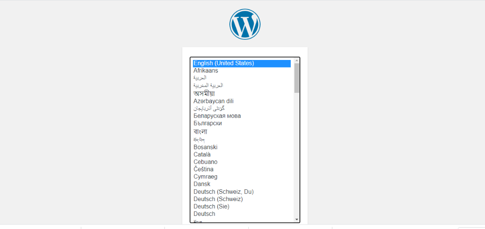
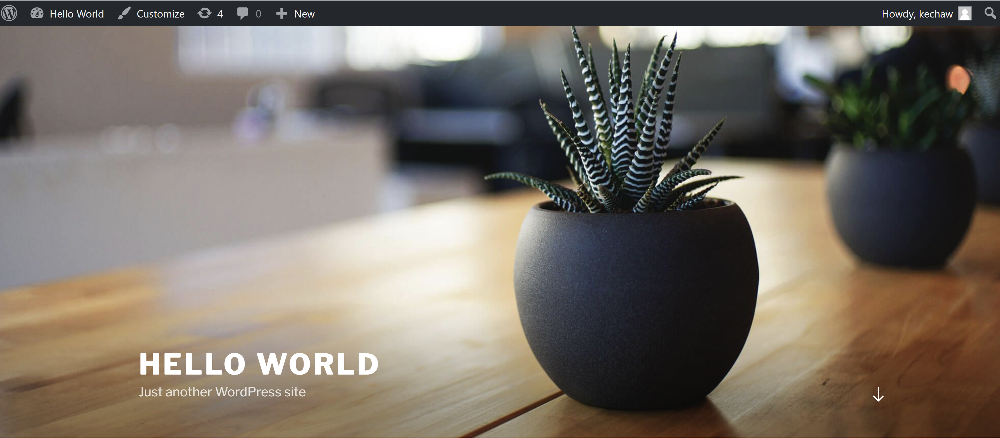

## Installing WordPress and MySQL

Now, we are ready to install WordPress and Mysql in our cluster. For that, we need to copy the 3 files given in a folder named `Wordpress-Mysql`.

This file `mysql-deployment.yml` contains information about the different settings to be applied to our MySQL pod.

Similarly, the file `wordpress-deployment.yml` contains information about the different settings to be applied to our WordPress pod.

At last, we have a `kustomization.yml` file to specify the order of execution of the files along with the secret keys.

By running the command `kubectl create -k . -n wp-mysql` within the Wordpress-Mysql directory,  the scripts will be execute and create all the resources for deploying a WordPress site and a MySQL database.

Verify that the Pod is running by running the following command:
```bash
kubectl get pods
```
The response should be like this:

```bash
NAME                               READY   STATUS    RESTARTS   AGE
wordpress-79d68d56b9-9qjnc         1/1     Running   0          11m
wordpress-mysql-6b7b9b4c87-bzvl5   1/1     Running   0          11m
```

Verify that a PersistentVolume got dynamically provisioned.

```bash
kubectl get pvc
```
The response should be like this:

```bash
NAME             STATUS   VOLUME                                     CAPACITY   ACCESS MODES   STORAGECLASS   AGE
mysql-pv-claim   Bound    pvc-1e879b20-5794-4258-b9be-64c9a9de6bca   20Gi       RWO            gp2            11m
wp-pv-claim      Bound    pvc-40345585-969d-4b37-91b0-eaca60b79661   20Gi       RWO            gp2            11m
```

Verify that the Secret exists by running the following command:

```bash
kubectl get secrets
```
The response should be like this:

```bash
NAME                    TYPE     DATA   AGE
mysql-pass-8d668bfdmt   Opaque   1      12m
```

Get the `External-IP` of our wordpress service by running the below command and browse your wordpress site:

```bash
kubectl get services wordpress
```
The response should be like this:

```bash
NAME        TYPE           CLUSTER-IP     EXTERNAL-IP                             PORT(S)        AGE
wordpress   LoadBalancer   10.0.206.193   http://xx.us-east-2.elb.amazonaws.com   80:30569/TCP   13m
```

On visiting the `External-IP` URL, we will reach this page.



After configuration and posting our first post, we will reach to this following page:



### Next Step
[Setup Velero in EKS and take bakup](setup-velero-backup-eks.md)