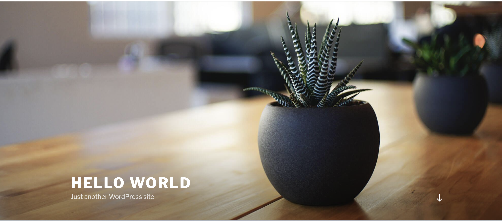

## Restore EKS Backup to AKS cluster using Velero

This section shows how to restore your EKS backup that was created with Velero to AKS cluster.

Once the backup is available to azure storage, test to ensure the restoration is working as intended. First, switch the Kubernetes context to the AKS cluster:

```powershell
$RECOVERY_CONTEXT="aks_restore_velero"
kubectl config use-context $RECOVERY_CONTEXT
```
Regardless of how volumes are discovered for backup using FSB, the process of restoring remains the same. To restore the cluster resources, run the command:

```Azcli
velero restore create aks-wp-mysql-restore --from-backup eks-wp-mysql-backup --wait
```
The output should be similar to:

```
Restore request "aks-wp-mysql-restore" submitted successfully.
Run `velero restore describe aks-wp-mysql-restore` or `velero restore logs aks-wp-mysql-restore` for more details.
```
To verify the status of your restore progress you can run the below command:

```bash
velero restore describe aks-wp-mysql-restore --details
```
Look for the field `Phase:` in the output of the command. If the current `Phase` is `InProgress`, then wait a few moments and try again until you see the `Phase: Completed`. You can see additional details of the backup, including information such as the start time and completion time, Resource list, along with the number of items restored.

Once you see the `Phase: Completed` you should see the output similar to:

```
Name:         aks-wp-mysql-restore
Namespace:    velero
Labels:       <none>
Annotations:  <none>

Phase:                       Completed
Total items to be restored:  19
Items restored:              19

Started:    2024-02-02 12:09:45 +0530 IST
Completed:  2024-02-02 12:11:26 +0530 IST

Backup:  eks-wp-mysql-backup

Namespaces:
  Included:  all namespaces found in the backup
  Excluded:  <none>

Resources:
  Included:        *
  Excluded:        nodes, events, events.events.k8s.io, backups.velero.io, restores.velero.io, resticrepositories.velero.io, csinodes.storage.k8s.io, volumeattachments.storage.k8s.io, backuprepositories.velero.io
  Cluster-scoped:  auto

Namespace mappings:  <none>

Label selector:  <none>

Or label selector:  <none>

Restore PVs:  auto

Existing Resource Policy:   <none>
ItemOperationTimeout:       4h0m0s

Preserve Service NodePorts:  auto
```

### Validate the restored Resources in AKS cluster

To verify that all the resources are succesfully restored from EKS backup, run the below commands:

```bash
kubectl get all,cm,secret,pv,pvc -n wp-mysql
```

The output will be similar to:

```
NAME                                   READY   STATUS    RESTARTS   AGE
pod/wordpress-79d68d56b9-9qjnc         1/1     Running   0          7m31s
pod/wordpress-mysql-6b7b9b4c87-bzvl5   1/1     Running   0          7m31s

NAME                      TYPE           CLUSTER-IP    EXTERNAL-IP   PORT(S)        AGE
service/wordpress         LoadBalancer   10.0.40.253   x.xxx.xx.xx   80:30257/TCP   7m31s
service/wordpress-mysql   ClusterIP      None          <none>        3306/TCP       7m31s

NAME                              READY   UP-TO-DATE   AVAILABLE   AGE
deployment.apps/wordpress         1/1     1            1           7m31s
deployment.apps/wordpress-mysql   1/1     1            1           7m31s

NAME                                         DESIRED   CURRENT   READY   AGE
replicaset.apps/wordpress-79d68d56b9         1         1         1       7m31s
replicaset.apps/wordpress-mysql-6b7b9b4c87   1         1         1       7m31s

NAME                         DATA   AGE
configmap/kube-root-ca.crt   1      84m

NAME                           TYPE     DATA   AGE
secret/mysql-pass-8d668bfdmt   Opaque   1      7m31s

NAME                                                        CAPACITY   ACCESS MODES   RECLAIM POLICY   STATUS   CLAIM                      STORAGECLASS   REASON   AGE
persistentvolume/pvc-6e5f9369-0cb4-4e5a-8b13-4cb32e7410d9   20Gi       RWO            Delete           Bound    wpmsqlnew/wp-pv-claim      gp2
           7m28s
persistentvolume/pvc-78815d49-5f89-4260-84cb-3b5d84eaeb47   20Gi       RWO            Delete           Bound    wpmsqlnew/mysql-pv-claim   gp2
           7m29s

```
#### Test the wordpress application

As we have now restored the worloads to AKS cluster its time to test the wordpress application by browing the `External-IP`, we will reach this page.

