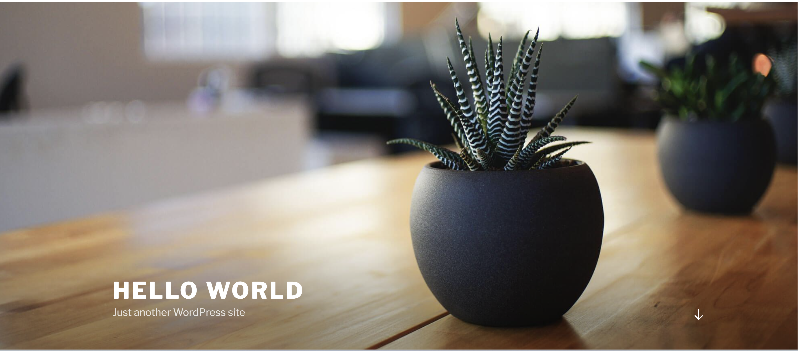

## Setup Velero for AKS Restore

This section describes how to install and use Velero to restore workload backed up from EKS cluster using Azure Blob Storage

Open PowerShell as an administrator.

Run the following command to log in to Azure interactively:

```azcli
az login
```
Use the subscription name to find the subscription ID:

```azcli
$AZURE_SUBSCRIPTION_ID="<Your_Azure_SUBSCRIPTION_ID>"
```
Set the Azure subscription"

```azcli 
az account set -s $AZURE_BACKUP_SUBSCRIPTION_ID 
```

#### Create Azure Storage Account & Blob Container

Here we will create a storage account and a blob container to store the backup created in aws bucket.

Create an storage account to store backups from aws bucket

```azcli
$RESOURCE_GROUP="myResourceGroup"

$AZURE_STORAGE_ACCOUNT_ID="velerostorageaccount"
az storage account create --name $AZURE_STORAGE_ACCOUNT_ID --resource-group $RESOURCE_GROUP --sku Standard_GRS --encryption-services blob --https-only true --kind BlobStorage --access-tier Hot
```

Create a blob container:
```azcli
$BLOB_CONTAINER="velero"
az storage container create -n $BLOB_CONTAINER --public-access off --account-name $AZURE_STORAGE_ACCOUNT_ID
```
#### Create a Service Principal to grant permission to velero

Get the subscription ID and tenant ID for your Azure account:

```azcli
$AZURE_SUBSCRIPTION_ID=(az account list --query '[?isDefault].id' -o tsv)
$AZURE_TENANT_ID=(az account list --query '[?isDefault].tenantId' -o tsv)
```

##### Create a service principal

You can create a service principal with the Contributor role or use a custom role:

Contributor role: The Contributor role grants subscription-wide access, so be sure protect this credential if you assign that role.
Custom role: If you need a more restrictive role, use a custom role.

To create a service principal with the Contributor role, use the following command. Substitute your own subscription ID and, optionally, your own service principal name. Microsoft Entra ID will generate a secret for you.

```azcli
$AZURE_CLIENT_SECRET=(az ad sp create-for-rbac --name "azvelerosp" --role "Contributor" --query 'password' -o tsv --scopes  /subscriptions/$AZURE_SUBSCRIPTION_ID)
```

Get the service principal name, and assign that name to the `AZURE_CLIENT_ID` variable:

```azcli
$AZURE_CLIENT_ID=(az ad sp list --display-name "azvelerosp" --query '[0].appId' -o tsv)
```

Create a file that contains the variables the Velero installation requires. The command looks similar to the following one:

```
AZURE_SUBSCRIPTION_ID=$AZURE_SUBSCRIPTION_ID
AZURE_TENANT_ID=$AZURE_TENANT_ID
AZURE_CLIENT_ID=$AZURE_CLIENT_ID
AZURE_CLIENT_SECRET=$AZURE_CLIENT_SECRET
AZURE_RESOURCE_GROUP=$RESOURCE_GROUP
AZURE_CLOUD_NAME=AzurePublicCloud" | Out-File -FilePath ./credentials-velero.txt
```

### Installing Velero server in AKS Cluster

Install Velero on the cluster, and start the deployment. This procedure creates a namespace called velero and adds a deployment named velero to the namespace.

```azcli
velero install --provider azure --plugins velero/velero-plugin-for-microsoft-azure:v1.5.0 --bucket $BLOB_CONTAINER --secret-file ./credentials-velero.txt --backup-location-config resourceGroup=$RESOURCE_GROUP,storageAccount=$AZURE_STORAGE_ACCOUNT_ID,subscriptionId=$AZURE_SUBSCRIPTION_ID --uploader-type "restic" --use-volume-snapshots --use-node-agent
```
To check whether the Velero service is running properly First, switch context to the recovery context that we created earlier by using this command:


```powershell
$RECOVERY_CONTEXT="aks_restore_velero"
kubectl config use-context $RECOVERY_CONTEXT

kubectl -n velero get pods
kubectl logs deployment/velero -n velero
```

The get pods command should show that the Velero pods are running as shown below:

```bash
NAME                      READY   STATUS    RESTARTS   AGE
node-agent-28lx7          1/1     Running   0          2d
node-agent-d78wq          1/1     Running   0          2d
node-agent-htrrw          1/1     Running   0          2d
velero-6686c4848f-nr487   1/1     Running   0          2d
```
Check if the Backup Storage Location is in “Available” state: 

```bash
velero backup-location get

NAME      PROVIDER   BUCKET/PREFIX   PHASE       LAST VALIDATED                  ACCESS MODE   DEFAULT
default   azure      velero          Available   2024-01-31 17:50:25 +0530 IST   ReadWrite     true
```

### Copy data from Amazon S3 to Azure Storage by using AzCopy

As we already have the velero client installed in the previous step lets copy the data from AWS bucket to Azure Blob Storage using AzCopy. AzCopy is a command-line utility that you can use to copy blobs or files to or from a storage account.

#### Download and install AzCopy

These files are compressed as a zip file (Windows and Mac) or a tar file (Linux). To download and decompress the tar file on Linux, see the documentation for your Linux distribution.

For detailed information on AzCopy releases, see the [AzCopy release page](https://github.com/Azure/azure-storage-azcopy/releases).

First, download the AzCopy executable file to any directory on your computer. AzCopy is just an executable file, so there's nothing to install.

[Windows 64-bit (zip)](https://aka.ms/downloadazcopy-v10-windows)
[Windows 32-bit (zip)](https://aka.ms/downloadazcopy-v10-windows-32bit)
[Linux x86-64 (tar)](https://aka.ms/downloadazcopy-v10-linux)
[Linux ARM64 (tar)](https://aka.ms/downloadazcopy-v10-linux-arm64)
[macOS (zip)](https://aka.ms/downloadazcopy-v10-mac)
[macOS ARM64 Preview (zip)](https://aka.ms/downloadazcopy-v10-mac-arm64)

**Authorize with Azure Storage**
Run the below command to Authorize with Azure Storage

```azcli
AzCopy login
```

**Authorize with Azure Storage**

Gather your AWS access key and secret access key, and then set these environment variables:

| Operating system | Command  |
|--------|-----------|
| **Windows** | `set AWS_ACCESS_KEY_ID=<access-key>`<br>`set AWS_SECRET_ACCESS_KEY=<secret-access-key>` |
| **Linux** | `export AWS_ACCESS_KEY_ID=<access-key>`<br>`export AWS_SECRET_ACCESS_KEY=<secret-access-key>`|
| **macOS** | `export AWS_ACCESS_KEY_ID=<access-key>`<br>`export AWS_SECRET_ACCESS_KEY=<secret-access-key>`|

These credentials are used to generate pre-signed URLs that are used to copy objects.

Copy a bucket

```bash
azcopy copy 'https://s3.amazonaws.com/$BLOB_CONTAINER' 'https://$AZURE_STORAGE_ACCOUNT_ID.blob.core.windows.net/$BLOB_CONTAINER' --recursive=true
```
`$Bucket` is the name of aws s3 bucket that we have created to storage velero backup in previous step.
`$AZURE_STORAGE_ACCOUNT_ID` and `$BLOB_CONTAINER` is the name of Azure blob storage account and container name that we have created earlier in this article.

For more details, See [Copy data from Amazon S3 to Azure Storage by using AzCopy](https://learn.microsoft.com/en-us/azure/storage/common/storage-use-azcopy-s3).

To verify the list of blob copied in the Azure storage container from aws s3 bucket run the below command:

```azcli
az storage blob list -c $BLOB_CONTAINER --account-name AZURE_STORAGE_ACCOUNT_ID --output table
```

Verify the velero backup using below command:

```bash
velero backup get
```

you should see the output similar to what you have seen in aws:

```
NAME                  STATUS      ERRORS   WARNINGS   CREATED                         EXPIRES   STORAGE LOCATION   SELECTOR
eks-wp-mysql-backup   Completed   0        0          2024-02-02 11:41:51 +0530 IST   29d       default            <none>

```

### Restore EKS Backup to AKS cluster using Velero

This section shows how to restore your EKS backup that was created with Velero to AKS cluster.

Once the backup is saved, test to ensure the restoration is working as intended. First, switch the Kubernetes context to the AKS cluster:

```powershell
$RECOVERY_CONTEXT="aks_restore_velero"
kubectl config use-context $RECOVERY_CONTEXT
```
To restore the cluster resources, run the command:

```Azcli
velero restore create aks-wp-mysql-restore --from-backup eks-wp-mysql-backup
```
The output should be similar to:

```
Restore request "aks-wp-mysql-restore" submitted successfully.
Run `velero restore describe aks-wp-mysql-restore` or `velero restore logs aks-wp-mysql-restore` for more details.
```
To verify the status of your restore progress you can run the below command:

```bash
velero restore describe aks-wp-mysql-restore --details
```

you should see the output similar to:

```
Name:         aks-wp-mysql-restore
Namespace:    velero
Labels:       <none>
Annotations:  <none>

Phase:                       Completed
Total items to be restored:  19
Items restored:              19

Started:    2024-02-02 12:09:45 +0530 IST
Completed:  2024-02-02 12:11:26 +0530 IST

Backup:  eks-wp-mysql-backup

Namespaces:
  Included:  all namespaces found in the backup
  Excluded:  <none>

Resources:
  Included:        *
  Excluded:        nodes, events, events.events.k8s.io, backups.velero.io, restores.velero.io, resticrepositories.velero.io, csinodes.storage.k8s.io, volumeattachments.storage.k8s.io, backuprepositories.velero.io
  Cluster-scoped:  auto

Namespace mappings:  <none>

Label selector:  <none>

Or label selector:  <none>

Restore PVs:  auto

Existing Resource Policy:   <none>
ItemOperationTimeout:       4h0m0s

Preserve Service NodePorts:  auto
```

Look for the field `Phase:` in the output of the command. If the current `Phase` is `InProgress`, then wait a few moments and try again until you see the `Phase: Completed`. You can see additional details of the backup, including information such as the start time and completion time, Resource list, along with the number of items restored.

### Validate the restored Resources in AKS cluster

To verify that all the resources are succesfully restored from EKS backup, run the below commands:

```bash
kubectl get all,cm,secret,pv,pvc -n wp-mysql
```

The output will be similar to:

```
NAME                                   READY   STATUS    RESTARTS   AGE
pod/wordpress-79d68d56b9-9qjnc         1/1     Running   0          7m31s
pod/wordpress-mysql-6b7b9b4c87-bzvl5   1/1     Running   0          7m31s

NAME                      TYPE           CLUSTER-IP    EXTERNAL-IP   PORT(S)        AGE
service/wordpress         LoadBalancer   10.0.40.253   x.xxx.xx.xx   80:30257/TCP   7m31s
service/wordpress-mysql   ClusterIP      None          <none>        3306/TCP       7m31s

NAME                              READY   UP-TO-DATE   AVAILABLE   AGE
deployment.apps/wordpress         1/1     1            1           7m31s
deployment.apps/wordpress-mysql   1/1     1            1           7m31s

NAME                                         DESIRED   CURRENT   READY   AGE
replicaset.apps/wordpress-79d68d56b9         1         1         1       7m31s
replicaset.apps/wordpress-mysql-6b7b9b4c87   1         1         1       7m31s

NAME                         DATA   AGE
configmap/kube-root-ca.crt   1      84m

NAME                           TYPE     DATA   AGE
secret/mysql-pass-8d668bfdmt   Opaque   1      7m31s

NAME                                                        CAPACITY   ACCESS MODES   RECLAIM POLICY   STATUS   CLAIM                      STORAGECLASS   REASON   AGE
persistentvolume/pvc-6e5f9369-0cb4-4e5a-8b13-4cb32e7410d9   20Gi       RWO            Delete           Bound    wpmsqlnew/wp-pv-claim      gp2
           7m28s
persistentvolume/pvc-78815d49-5f89-4260-84cb-3b5d84eaeb47   20Gi       RWO            Delete           Bound    wpmsqlnew/mysql-pv-claim   gp2
           7m29s

```
#### Test the wordpress application

As we have now restored the worloads to AKS cluster its time to test the wordpress application by browing the `External-IP`, we will reach this page.

